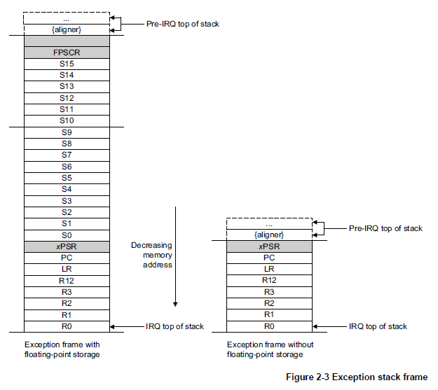

# Assignment 07

### 1. Starting from the blinking LED code that you created using the GPIO registers:
| | |
|:-:|:-|
| a. | Define your own vector table. |
| b. | Enable the use of the SysTick timer and its interrupt. |
| c. | Replace the delay() function with the use of the SysTick timer to blink the user LED. |
| d. | Set a break point inside the SysTick_Handler interrupt and capture a snapshot of the stack once inside the interrupt and LR value. Explain what are those values stored on the stack at the moment the Handler gets invoked. |

> Code:
>  - [main.c](problem01/main.c)
>  - [stm32f401xe.c](problem01/stm32f401xe.c)

> Images:
>  - [stack](problem01/stack.png)
>  - [register](problem01/register.png)

<b>Explanation of stack values:</b>
The values in the stack correspond to an exception frame with floating-point storage (as seen in Figure 2-3 from &sect;2.3.7).

The 2 remaining values (1 is out of frame) correspond to the registers, R4 and LR, pushed at the start of <b>main()</b>.

<b>Explanation of the LR value:</b>
The ARM Cortex-MR Generic User Guide &sect;2.3.7 states

> ...At the same time, the processor writes an EXC_RETURN value to the LR. This indicates which stack pointer corresponds to the stack frame and what operation mode the processor was in before the entry occurred.

Further, the LR value of <b>0xFFFFFFE9</b> means:

> Return to Thread mode, exception return uses floating-point state from MSP and execution uses MSP after return.